<p align="center">
  
  
  
</p>

<h1 align="center">📚 Concept Learn</h1>
<p align="center"><strong>分阶段 · 交互式 · 持久化</strong> 的概念学习技能</p>
<p align="center">只有当你在当前阶段真正理解后，才会进入下一阶段。</p>

---

## 🗺️ 全局概览

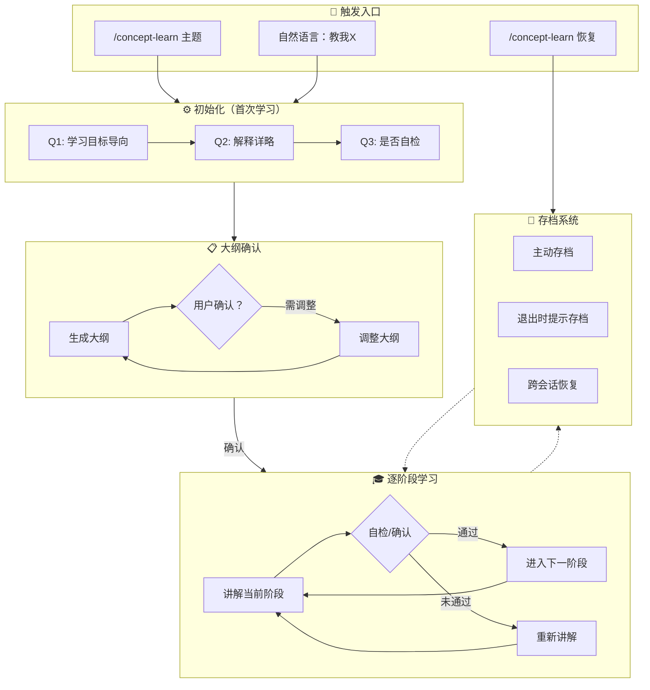

---

## 🚀 快速开始

### 最简用法

```
/concept-learn Python
```

触发后，技能会依次问你 3 个问题（每个都有推荐默认值，回复"默认"即可快速跳过），然后生成专属大纲，确认后即可开始学习。

### 30 秒体验流程

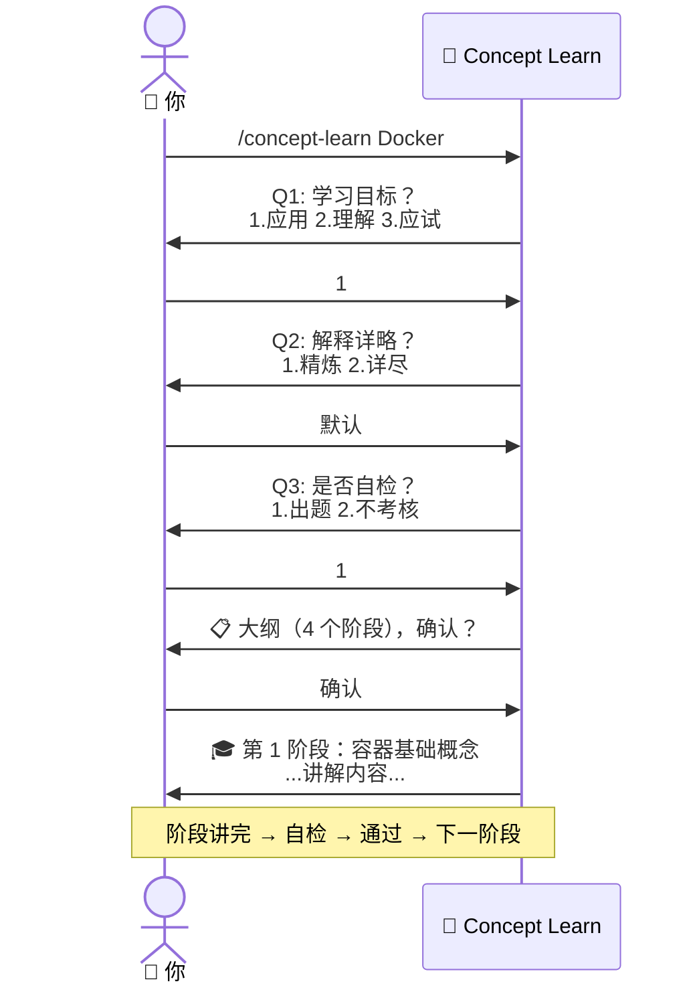

---

## 🎯 触发条件

技能通过两类入口激活，覆盖自然语言和显式命令：

| 类别 | 触发方式 | 示例 |
|---|---|---|
| **显式命令** | `/concept-learn` | `/concept-learn` → 询问主题 |
| | `/concept-learn <主题>` | `/concept-learn Rust` |
| | `/concept-learn 恢复` | `/concept-learn 恢复` → 列出存档 |
| | `/concept-learn 恢复 <主题>` | `/concept-learn 恢复 React` |
| **自然语言** | 表达系统性学习意图 | "教我 Kubernetes" |
| | | "我想学 TypeScript 泛型" |
| | | "带我掌握设计模式" |

### ❌ 不触发的情况

以下是一次性问答，不会触发分阶段教学：

| 情况 | 示例 | 原因 |
|---|---|---|
| 一次性查询 | "Docker 是什么" | 一句话能答完 |
| 求助式提问 | "帮我看看这个报错" | 非学习意图 |
| 应试速查 | "React 常考点有哪些" | 不是分阶段学习 |

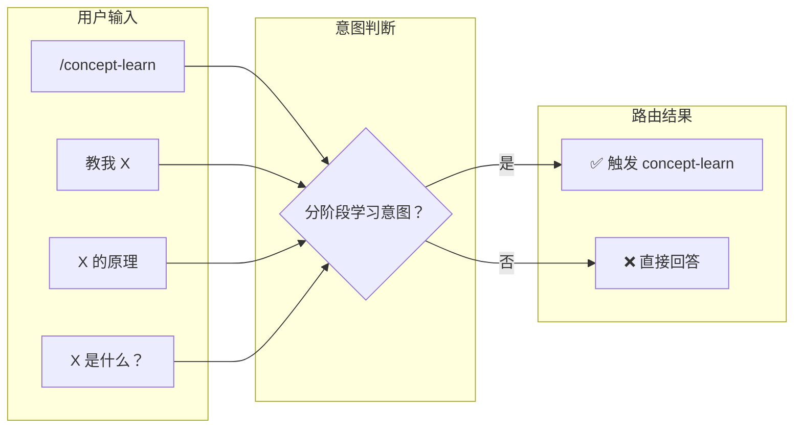

---

## ⚙️ 执行前提问（3 个必答问题）

触发后、列出大纲前，技能会依次提出 3 个问题——**一次只问一个**，等用户回答后再问下一个。

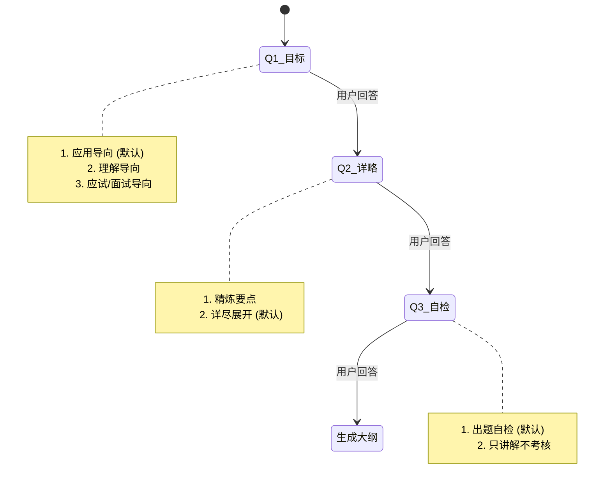

| 问题 | 选项 | 默认值 | 影响范围 |
|---|---|---|---|
| **Q1 — 学习目标导向** | ① 应用导向 ② 理解导向 ③ 应试导向 | ① 应用导向 | 内容的侧重点（实操 vs 原理 vs 考点） |
| **Q2 — 解释详略** | ① 精炼要点 ② 详尽展开 | ② 详尽展开 | 每个阶段的深度和细节量 |
| **Q3 — 是否自检** | ① 出题自检 ② 只讲解不考核 | ① 出题自检 | 阶段间是否需要答题通过才能放行 |

> 💡 **提示**：回复"默认"即可快速跳过任何问题，使用推荐的默认选项。

---

## 📋 大纲生成与确认

3 个问题回答完毕后，技能根据你的偏好生成完整学习大纲。

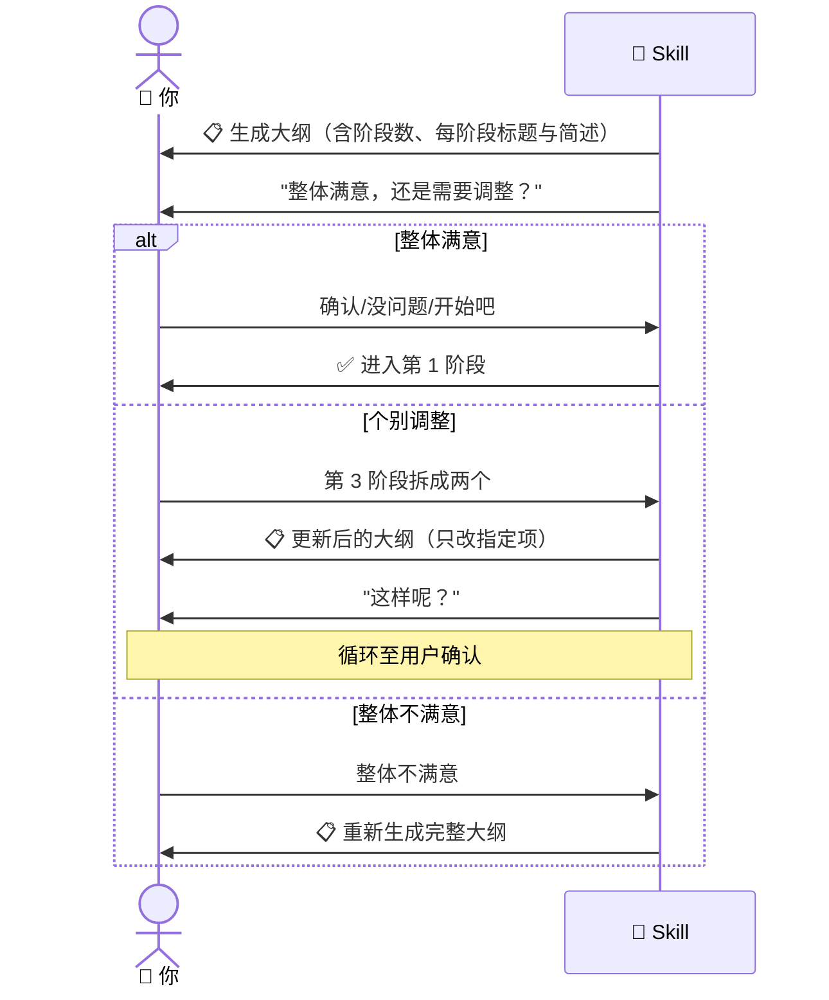

### 大纲示例

```
学习主题：Docker
学习目标导向：应用
解释详略：详尽
是否自检：是

大纲：
第 1 阶段：容器与镜像 —— Docker 的核心概念和关系
第 2 阶段：Dockerfile 实战 —— 编写和构建自定义镜像
第 3 阶段：多容器编排 —— Docker Compose 基础
第 4 阶段：网络与存储 —— 容器通信与数据持久化
第 5 阶段：生产最佳实践 —— 安全、优化与调试
```

---

## 🎓 逐阶段讲解流程

大纲确认后，严格按顺序逐阶段推进。每个阶段讲完后，必须通过"放行机制"才能进入下一阶段。

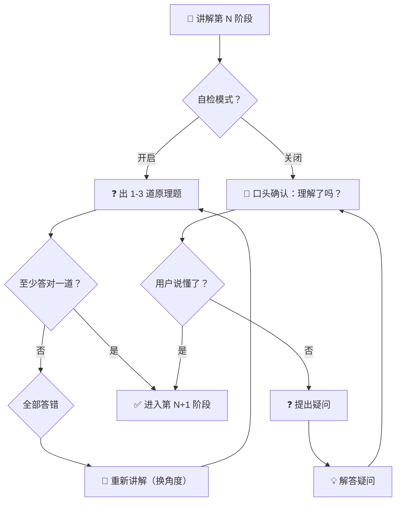

### 🛠️ 中途操作

学习过程中，你随时可以执行以下操作，不会丢失进度：

| 操作 | 触发词 | 效果 |
|---|---|---|
| **开启/关闭自检** | "开启自检" / "关闭自检" | 切换后续阶段的放行模式 |
| **跳过阶段** | "第 3 阶段我已会，跳过" | 标记为已完成，跳到下一阶段 |
| **复习阶段** | "复习一下第 1 阶段" | 重新讲解指定阶段，不改变当前进度 |
| **查询进度** | "刚刚讲到哪了" | 显示当前阶段信息 |
| **主动存档** | "保存进度" | 立刻写入存档文件 |
| **退出学习** | "退出" / "今天就到这" | 检查未保存进度 → 提示存档 → 退出 |

---

## 📊 阶段状态机

每个学习阶段在系统中流转以下三种状态：

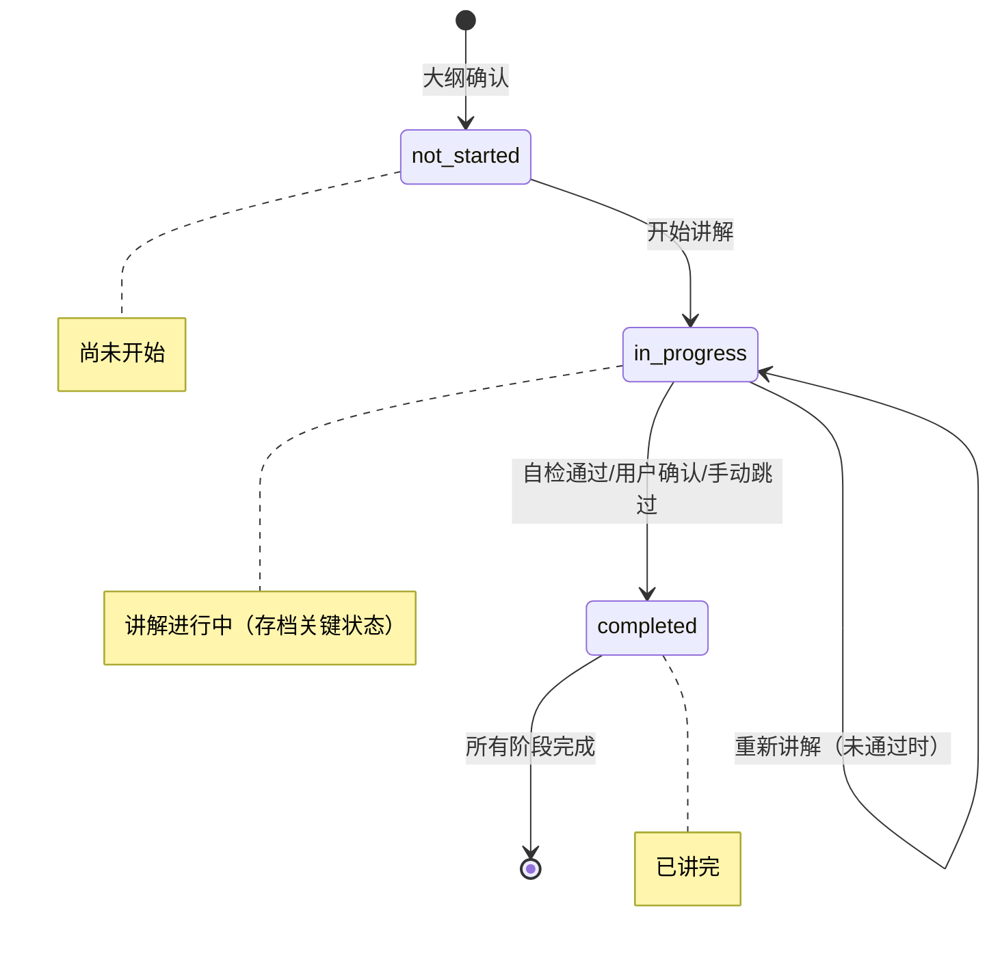

---

## 💾 存档系统

每次学习的进度持久化到工作区目录，支持跨会话无缝恢复。

### 目录结构

```
当前工作区/
└── .concept-learn/
    ├── docker/
    │   └── save.md          # Docker 学习存档
    ├── react/
    │   └── save.md          # React 学习存档
    └── typescript-generics/
        └── save.md          # TypeScript 泛型学习存档
```

### 存档文件结构

每个 `save.md` 由 **YAML frontmatter**（结构化元数据）和 **Markdown 正文**（完整讲解内容）两部分组成：

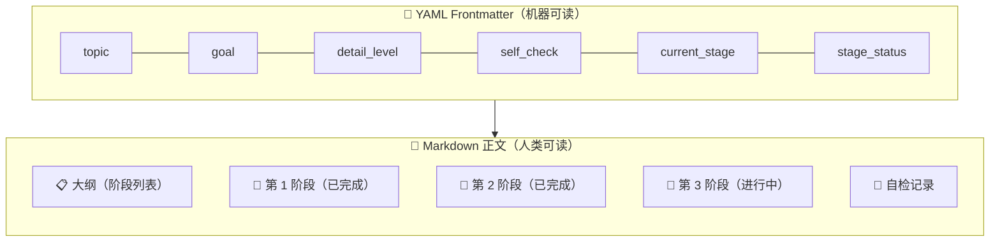

| 区域 | 内容 | 用途 |
|---|---|---|
| **Frontmatter** | `topic`, `goal`, `detail_level`, `self_check`, `outline`, `current_stage`, `stage_status`, `created_at`, `updated_at` | 程序化读取进度、恢复状态 |
| **正文** | 大纲列表 + 每个已讲解阶段的完整内容 + 自检记录 | 人类回顾学习内容、从中断处恢复上下文 |

### 存档时机

```mermaid
flowchart LR
    A["📖 学习进行中"] --> B{"触发存档？"}
    
    B -->|用户主动说"保存进度"| C["💾 覆盖写入 save.md"]
    B -->|用户说"退出/结束学习"| D{"有未保存进度？"}
    B -->|所有阶段完成| E["🎉 输出总结 → 删除存档"]
    
    D -->|是| F{"是否保存？"}
    D -->|否| G["👋 直接退出"]
    
    F -->|是| C --> G
    F -->|否| G
    F -->|取消退出| A
```

---

## 🔄 存档恢复

新会话中恢复学习进度，支持显式命令和自然语言两种方式。

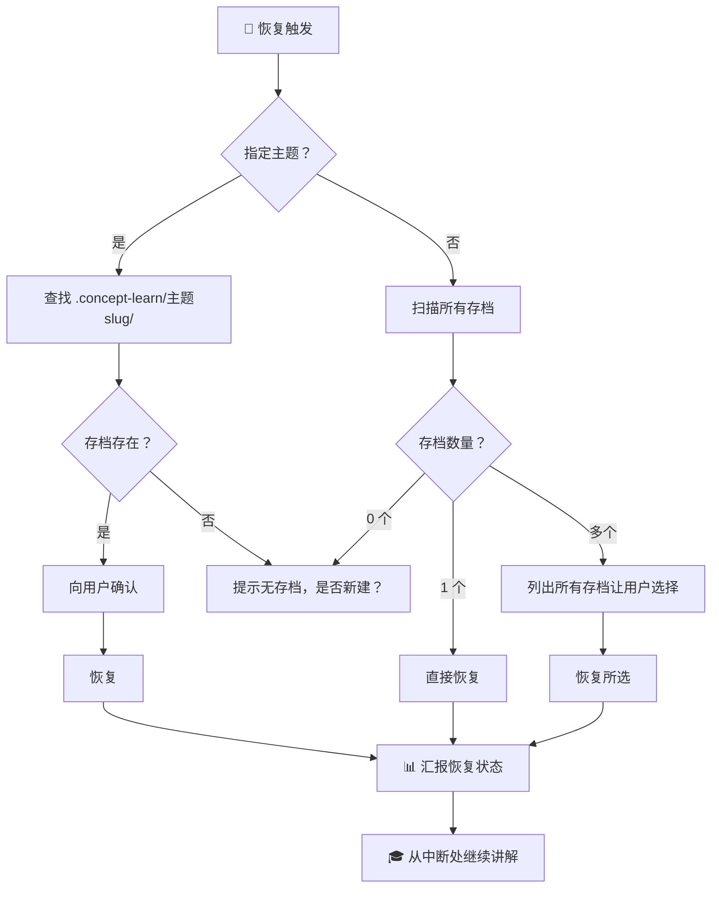

### 恢复状态汇报示例

```
已恢复学习存档：
主题：Docker
学习目标：应用导向
详略：详尽
当前进度：第 3 阶段（多容器编排）—— 进行中

将从第 3 阶段继续讲解。
```

---

## 📖 使用示例

### 示例 1：完整首次学习流程

```
👤 用户：/concept-learn Python 装饰器

🤖 技能：Q1 — 你学这个概念是为了什么目的？
        1. 应用导向（默认）
        2. 理解导向
        3. 应试/面试导向

👤 用户：2

🤖 技能：Q2 — 每个阶段的内容讲到多深？
        1. 精炼要点
        2. 详尽展开（默认）

👤 用户：默认

🤖 技能：Q3 — 每个阶段讲完后要出题检验吗？
        1. 出题自检（默认）
        2. 只讲解不考核

👤 用户：1

🤖 技能：📋 以下是学习大纲——
        学习主题：Python 装饰器
        学习目标导向：理解
        解释详略：详尽
        是否自检：是
        
        大纲：
        第 1 阶段：函数是一等公民 —— 理解 Python 函数对象
        第 2 阶段：闭包与自由变量 —— 装饰器的前置知识
        第 3 阶段：装饰器原理 —— 语法糖与函数包装
        第 4 阶段：带参数的装饰器 —— 装饰器工厂模式
        第 5 阶段：进阶应用 —— functools.wraps、类装饰器
        
        整体满意，还是需要调整？

👤 用户：确认

🤖 技能：## 第 1 阶段：函数是一等公民
        ...（详细讲解内容）...
        
        ❓ 自检题：请描述 Python 中函数作为一等公民的
        三个表现，并说明这与装饰器机制的关联。

👤 用户：（回答）

🤖 技能：✅ 回答正确！进入第 2 阶段...
```

### 示例 2：中断后恢复

```
👤 用户：继续上次学的 Docker

🤖 技能：已恢复学习存档：
        主题：Docker
        学习目标：应用导向
        详略：详尽
        当前进度：第 3 阶段（多容器编排）—— 进行中
        
        将从第 3 阶段继续讲解。
        
        ## 第 3 阶段：多容器编排
        上回讲到 docker-compose.yml 的基本结构，
        现在继续讲 services 的网络配置...
```

### 示例 3：中途灵活操作

```
👤 用户：第 2 阶段我已经会了，跳过

🤖 技能：已将第 2 阶段标记为已完成，进入第 3 阶段。
        ## 第 3 阶段：...

---
👤 用户：复习一下第 1 阶段

🤖 技能：（重新讲解第 1 阶段完整内容）
        复习完成，回到当前进度：第 3 阶段。

---
👤 用户：今天就到这

🤖 技能：你当前的学习进度尚未保存，是否需要保存？
        1. 是 — 保存后退出
        2. 否 — 不保存直接退出
        3. 取消退出 — 继续学习

👤 用户：1

🤖 技能：已存档至 .concept-learn/docker/save.md，
        当前进度：第 3 阶段（多容器编排）。下次见！
```

### 示例 4：多存档管理

```
👤 用户：/concept-learn 恢复

🤖 技能：找到以下学习存档：
        1. Docker —— 当前第 3 阶段（多容器编排）
        2. React —— 当前第 2 阶段（组件基础）
        3. Rust —— 当前第 1 阶段（所有权）
        
        请选择要继续的存档（输入序号或主题名）。

👤 用户：React

🤖 技能：已恢复 React 学习存档，从第 2 阶段继续...
```

---

## 🔧 完整生命周期

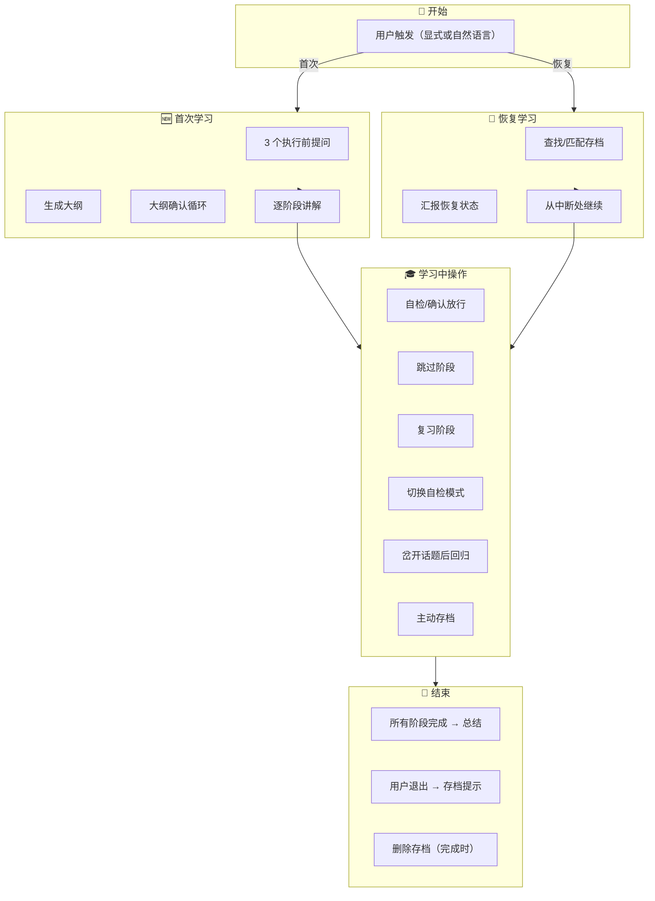

---

## 📐 关键技术决策

| 设计点 | 决策 | 理由 |
|---|---|---|
| **一次只问一个问题** | 严格一问一答 | 避免信息过载，防止用户一次性回答多个问题时的错位 |
| **大纲确认循环** | 必须用户显式确认 | 防止 AI 错误理解用户意图导致大纲偏离预期 |
| **阶段放行不可跳过** | 必须通过自检或口头确认 | 保证"学会才继续"的核心承诺 |
| **存档覆盖、不保留历史** | 每次存档覆盖旧文件 | 减少实现复杂度，用户需版本控制可用 git |
| **恢复时跳过 3 问** | 恢复时不重问偏好 | 偏好已固定在存档中，恢复即用 |
| **`stage_status` 为主** | 恢复时以 `stage_status` 为准 | 更精确地反映阶段状态，`current_stage` 仅作参考 |

---

## ⚠️ 边界情况处理

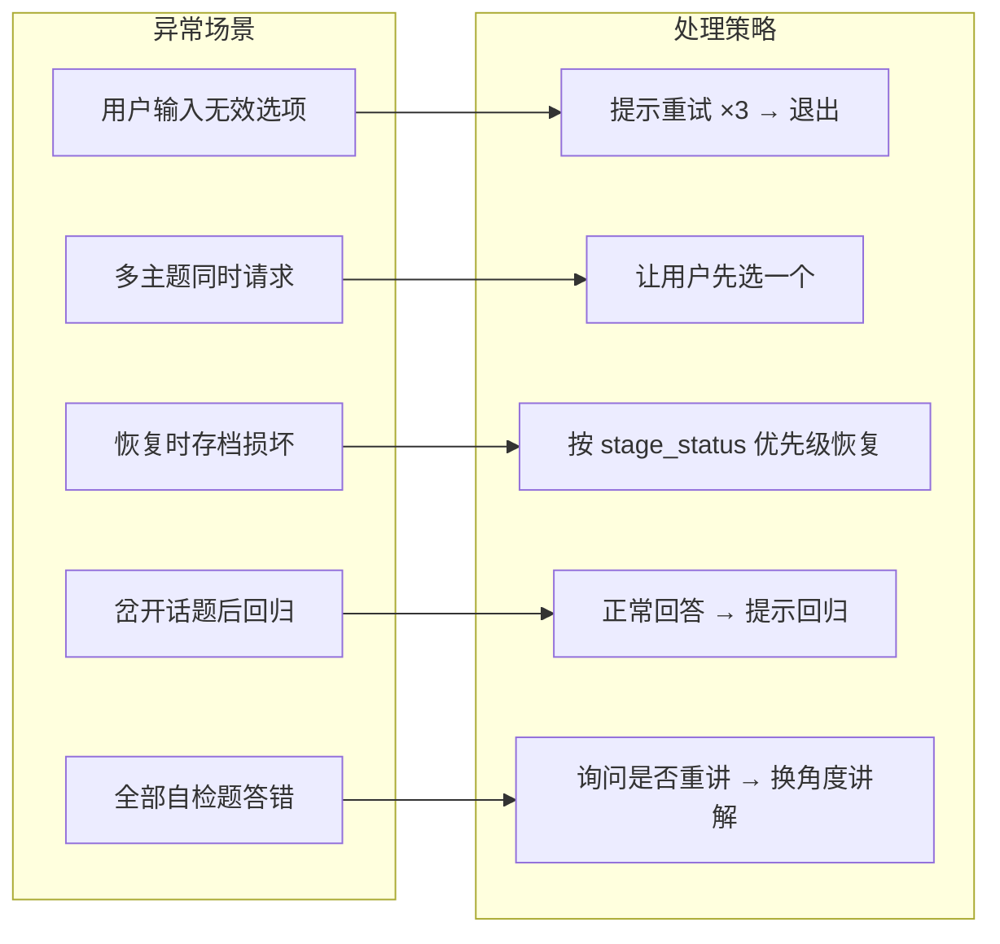

---

<p align="center">
  <sub>Built with ❤️ for systematic learners | 当你可以分阶段学习时，为什么要一次吞下所有内容？</sub>
</p>
