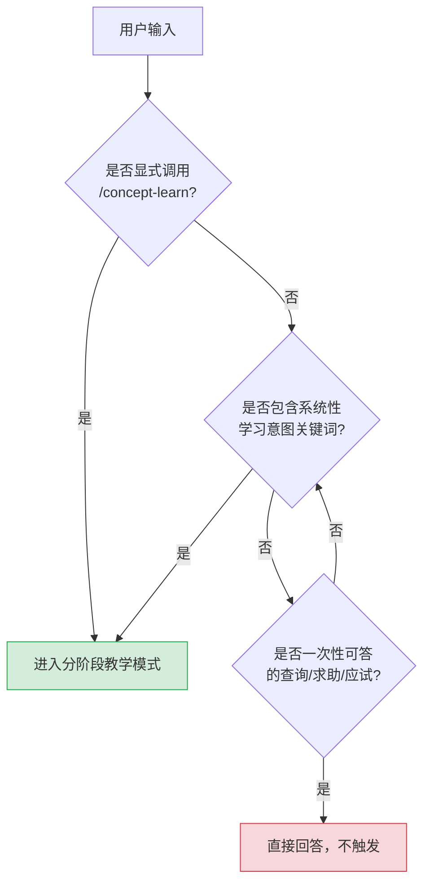
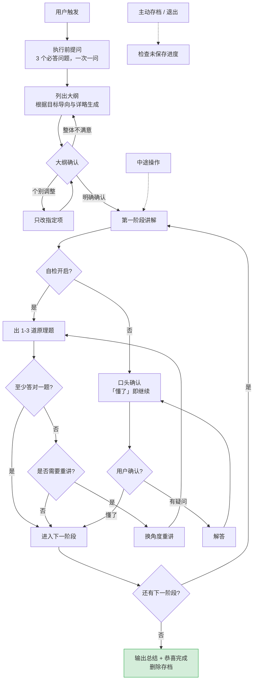
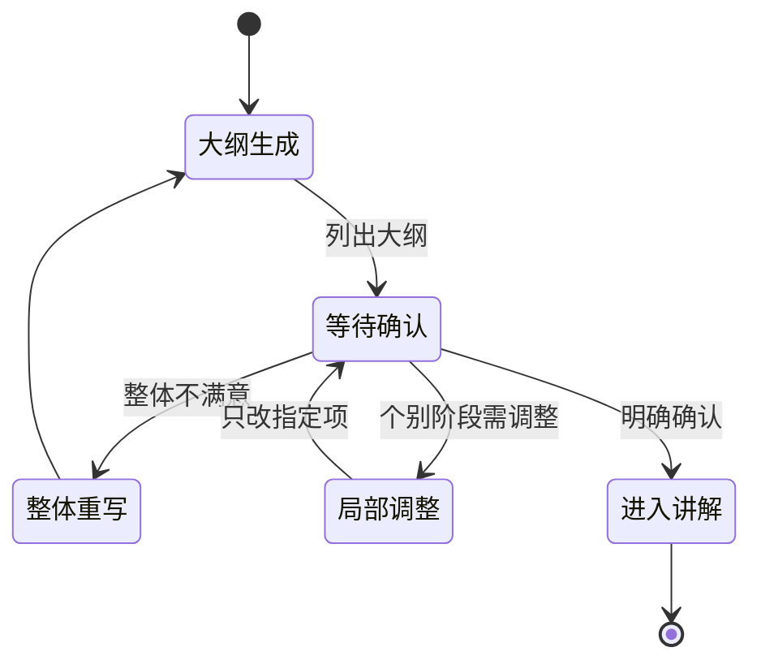
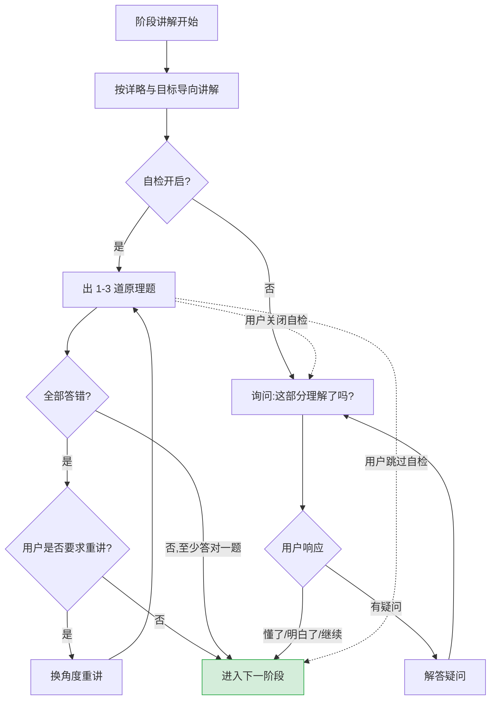
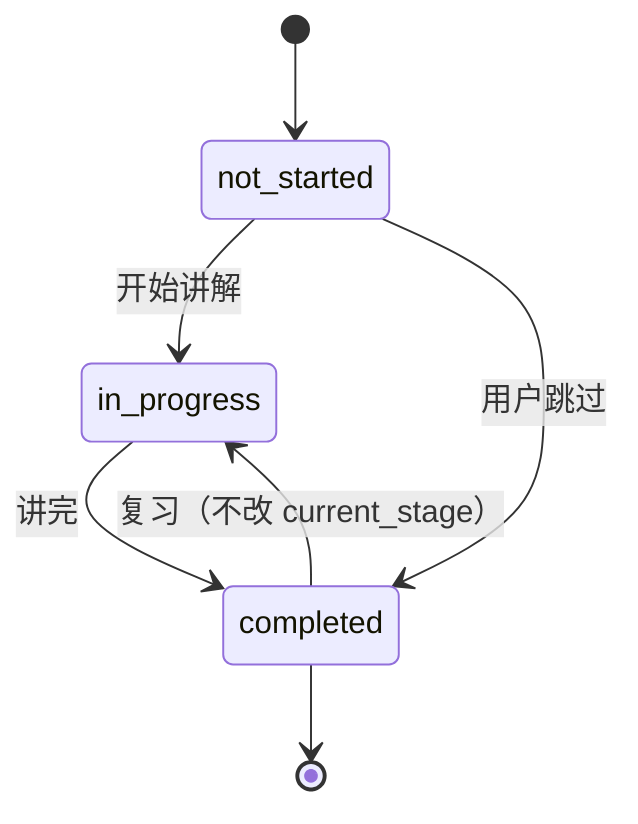
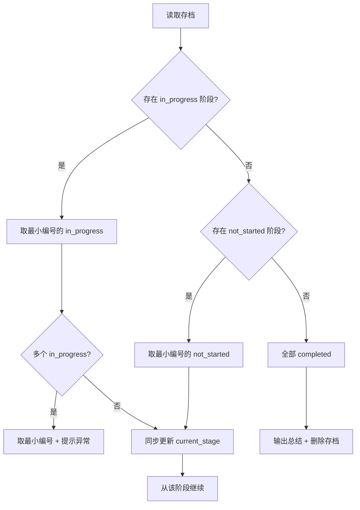
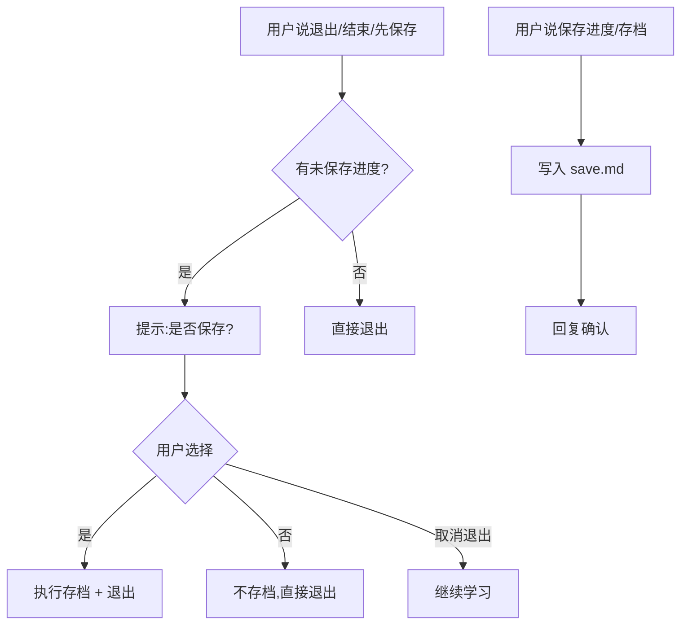
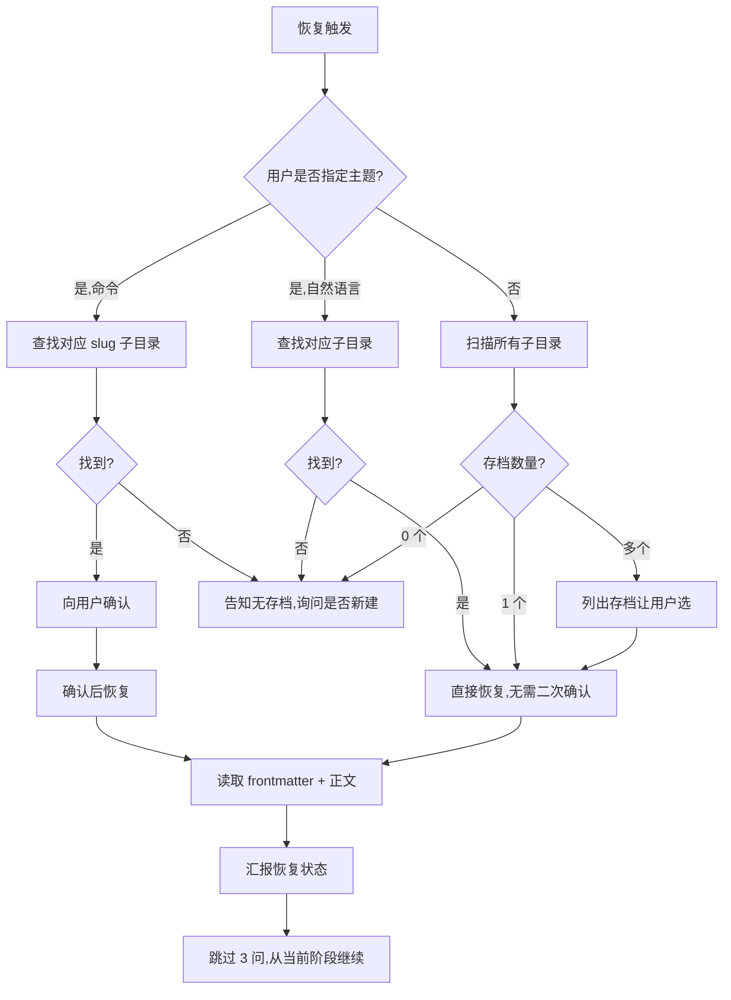

# Concept Learn · 分阶段概念学习技能

> 核心理念：**只有当用户在当前阶段理解后，才进入下一阶段。** 支持存档与恢复，跨会话延续学习进度。

---

## 一、技能概览

| 属性 | 说明 |
|------|------|
| 技能名称 | `concept-learn` |
| 触发方式 | 显式命令 `/concept-learn` 或自然语言学习意图 |
| 适用场景 | 系统性、分阶段学习某个概念或技术 |
| 核心机制 | 分阶段讲解 + 阶段放行 + 存档恢复 |
| 持久化 | 工作区 `.concept-learn/` 目录，Markdown + YAML frontmatter |
| 交互语言 | 中文（技术术语与代码保持英文原貌） |

### 能力边界一览

| 能力 | 是否支持 | 说明 |
|------|:--------:|------|
| 分阶段讲解 | ✅ | 严格按大纲顺序，一次一个阶段 |
| 阶段自检考核 | ✅ | 1-3 道原理题，答对才放行 |
| 跳过 / 复习阶段 | ✅ | 跳过标记完成；复习不改当前进度 |
| 中途切换设置 | ✅ | 随时开启 / 关闭自检 |
| 主动存档 | ✅ | 用户说"保存进度"即触发 |
| 跨会话恢复 | ✅ | 读取存档从中断处继续 |
| 一次性问答 | ❌ | 不触发，直接回答即可 |

---

## 二、触发判断流程



### 触发与不触发对照

| 类型 | 关键词示例 | 是否触发 |
|------|-----------|:--------:|
| 显式命令 | `/concept-learn`、`/concept-learn React`、`/concept-learn 恢复` | ✅ |
| 学习意图 | "教我 X"、"我想学 X"、"带我掌握 X"、"X 的原理是什么" | ✅ |
| 一次性查询 | "X 是什么"、"X 怎么用"、"X 为什么报错" | ❌ |
| 求助式提问 | "帮我看看这个 X 的错误"、"帮我解决一下 X" | ❌ |
| 应试提问 | "X 的考点有哪些"、"X 常考题" | ❌ |

> **特殊规则**：即使用户口语化表达像一次性提问，只要显式调用了 `/concept-learn`，就进入分阶段教学模式。

### 命令变体

| 命令 | 行为 |
|------|------|
| `/concept-learn` | 回复"你想学什么？请告诉我主题名称。" |
| `/concept-learn <主题>` | 直接以该主题进入执行前提问 |
| `/concept-learn 恢复` | 列出所有可恢复的存档列表 |
| `/concept-learn 恢复 <主题>` | 查找并匹配对应主题存档，确认后恢复 |

### 主题提取示例

| 用户输入 | 提取结果主题 |
|----------|-------------|
| `/concept-learn 我想学 python` | `python` |
| `/concept-learn 我想学 python 的 async 原理` | `python async 原理` |
| `/concept-learn React` | `React` |
| "教我 React 和 Vue" | 多主题 → 提示用户先选一个 |

---

## 三、完整执行流程



### 中途可触发的操作

| 操作 | 触发示例 | 效果 |
|------|---------|------|
| 开启自检 | "开启自检" | 后续阶段按自检模式运行 |
| 关闭自检 | "关闭自检" | 后续阶段改为口头确认 |
| 跳过阶段 | "第 3 阶段我已会，跳过" | 标记 `completed`，跳到下一未完成阶段 |
| 复习阶段 | "复习一下第 1 阶段" | 重新讲解，完成后回当前进度，不改 `current_stage` |
| 主动存档 | "保存进度"、"存档" | 写入 `save.md` 并确认 |
| 岔开话题 | 任意非学习问题 | 正常回答后回到学习，不中断状态 |
| 查询进度 | "刚刚讲到哪了" | 回报当前阶段信息 |

---

## 四、执行前提问（3 个必答问题）


> 一次只问一个，答完再问下一个。每个问题提供推荐默认值，回"默认"可快速通过。

### 问题 1 · 学习目标导向

| 序号 | 选项 | 侧重 |
|:----:|------|------|
| 1 | 应用导向（默认） | 学完就能上手用，侧重实操和代码示例 |
| 2 | 理解导向 | 学透原理和设计思想，侧重概念演进和设计权衡 |
| 3 | 应试 / 面试导向 | 学完应对考核场景，侧重高频考点和标准答案 |

### 问题 2 · 解释详略

| 序号 | 选项 | 内容范围 |
|:----:|------|---------|
| 1 | 精炼要点 | 只讲核心定义、关键规则、最小可用示例 |
| 2 | 详尽展开（默认） | 核心定义 + 多个示例 + 类比解释 + 边界情况 + 常见误区 |

### 问题 3 · 是否自检

| 序号 | 选项 | 放行机制 |
|:----:|------|---------|
| 1 | 出题自检（默认） | 阶段讲完后出 1-3 道原理题，答对才进入下一阶段 |
| 2 | 只讲解不考核 | 阶段讲完后口头确认，说"懂了"就继续 |

### 异常输入处理

| 情况 | 处理 |
|------|------|
| 一次性回答多个问题 | 只取第一个答案，忽略其他，提示继续下一问 |
| 输入序号不在范围内 | 提示"无效选项，请重新选择" |
| 连续 3 次无效选项 | 退出整个流程，回复"已超过重试次数，concept-learn 已退出" |

---

## 五、大纲确认状态机



### 确认语义识别

| 类型 | 表达示例 | 是否视为确认 |
|------|---------|:------------:|
| 明确确认 | "大纲没问题"、"可以开始"、"开始吧"、"ok"、"好的"、"行"、"确认" | ✅ |
| 需要继续追问 | "我想想"、"等一下"、"再看看" | ❌ |
| 触发调整 | "第二个阶段能不能改一下" | ❌（进入调整流程） |
| 岔开话题 | 未针对大纲确认回复 | ❌ |

> **硬性规则**：未得到用户对大纲的明确确认，绝不允许进入讲解阶段。

---

## 六、阶段讲解与放行机制



### 自检模式对照

| 维度 | 自检开启 | 自检关闭 |
|------|---------|---------|
| 放行方式 | 出 1-3 道原理题，至少答对一题 | 口头确认，说"懂了"即继续 |
| 全部答错 | 询问是否重讲，重讲后再出题 | — |
| 跳过当前自检 | 用户说"跳过自检" → 直接放行 | — |
| 关闭后续自检 | 用户说"关闭自检" → 切换为本模式 | — |
| 持久化 | `self_check` 字段持久化，通过状态不持久化 | 同左 |

### 讲解规则

| 规则 | 说明 |
|------|------|
| 顺序 | 严格按大纲顺序，一次只讲一个阶段 |
| 详略 | 遵守用户选择的"解释详略" |
| 侧重 | 遵守用户选择的"学习目标导向" |
| 标题 | 开头标注阶段编号与标题，如 `## 第 2 阶段：组件与 props` |
| 术语 | 技术术语和代码保持英文原貌 |
| 可视化 | 必要时输出流程图 / 架构图 / 时序图，优先 Mermaid，不支持则用 ASCII |

---

## 七、阶段状态机



### 状态定义

| 状态 | 含义 |
|------|------|
| `not_started` | 该阶段未开始讲解 |
| `in_progress` | 该阶段讲解中（用于中途存档） |
| `completed` | 该阶段已讲完，内容保存在正文中 |

### 恢复时优先级规则



---

## 八、存档系统

### 目录结构

```
当前工作区/
  .concept-learn/
    react/
      save.md
    vue/
      save.md
    cpp-stl/
      save.md
```

> 子目录名 = 主题名 slug 化（转小写、空格转连字符、去除特殊字符）。

### 存档文件格式

Markdown + YAML frontmatter：

```markdown
---
topic: React
goal: 应用
detail_level: 详尽
self_check: true
outline:
  - stage: 1
    title: JSX 语法
    summary: JSX 的基本语法和规则
  - stage: 2
    title: 组件与 props
    summary: 组件定义、props 传递
current_stage: 3
stage_status:
  - stage: 1
    status: completed
  - stage: 2
    status: completed
  - stage: 3
    status: in_progress
  - stage: 4
    status: not_started
created_at: 2026-07-26
updated_at: 2026-07-26
---

# React 学习存档

## 大纲
1. JSX 语法 —— JSX 的基本语法和规则
2. 组件与 props —— 组件定义、props 传递
...

## 第 1 阶段：JSX 语法（已完成）
<完整讲解内容>

## 自检记录
- 第 1 阶段：通过
- 第 2 阶段：跳过
```

### 字段说明

| 字段 | 类型 | 含义 |
|------|------|------|
| `topic` | string | 学习主题（原始名称，如 "React"） |
| `goal` | enum | 学习目标导向（应用 / 理解 / 应试） |
| `detail_level` | enum | 解释详略（精炼 / 详尽） |
| `self_check` | bool | 是否自检，持久化，支持中途切换 |
| `outline` | list | 完整大纲（每阶段含编号、标题、简述） |
| `current_stage` | int | 当前所在阶段编号（从 1 开始） |
| `stage_status` | list | 每阶段状态（not_started / in_progress / completed） |
| `created_at` | date | 存档创建时间（YYYY-MM-DD） |
| `updated_at` | date | 最近更新时间（YYYY-MM-DD） |

### 主动存档与退出处理



### 未保存进度判定

| 场景 | 判定 |
|------|------|
| 已有存档，自上次存档后 `stage_status` 有变化 | 有未保存进度 |
| 无存档（首次学习），已进入任何阶段讲解 | 有未保存进度 |
| 还在大纲确认阶段就退出 | 无未保存进度，直接退出 |

---

## 九、恢复存档流程



### 恢复触发方式对照

| 触发方式 | 示例 | 是否需二次确认 |
|---------|------|:--------------:|
| 显式命令带主题 | `/concept-learn 恢复 React` | ✅ |
| 显式命令不带主题 | `/concept-learn 恢复` | 列出后由用户选 |
| 自然语言带主题 | "继续上次学的 React" | ❌ |
| 自然语言不带主题 | "继续上次的学习" | 单存档直接恢复，多存档让用户选 |

### 恢复后汇报模板

```
已恢复学习存档：
主题：React
学习目标：应用导向
详略：详尽
当前进度：第 3 阶段（state 与生命周期）—— 进行中

将从第 3 阶段继续讲解。
```

---

## 十、关键规则速查表

| # | 规则 | 说明 |
|:-:|------|------|
| 1 | 严格分阶段 | 绝不一次性讲完，按阶段逐步推进 |
| 2 | 严格确认 | 大纲未确认不许讲解；自检开启时阶段未通过不许进入下一阶段 |
| 3 | 存档覆盖 | 每次存档覆盖旧文件，不保留历史版本 |
| 4 | 自检持久化 | `self_check` 持久化，通过状态不持久化 |
| 5 | 用户始终可控 | 可随时跳过自检、关闭自检、跳过阶段、复习、存档、退出 |
| 6 | 岔开话题不中断 | 正常回答后回到学习，`current_stage` 不变 |
| 7 | 恢复跳过 3 问 | 恢复存档时直接进入讲解，不再问执行前提问 |
| 8 | 复习不改进度 | 复习完成后回到当前进度，不改变 `current_stage` |

---

## 十一、语言规则

| 场景 | 语言 |
|------|------|
| 与用户交互 | 中文 |
| SKILL.md 正文 | 中文为主，技术术语与代码保持英文 |
| 存档文件内容 | 中文，技术术语保持英文 |
| 自检题目 | 中文表述，代码保持英文 |

---

## 十二、文件清单

| 文件 | 作用 |
|------|------|
| `SKILL.md` | 技能定义与完整规则 |
| `README.md` | 本文档，技能说明与流程图解 |
